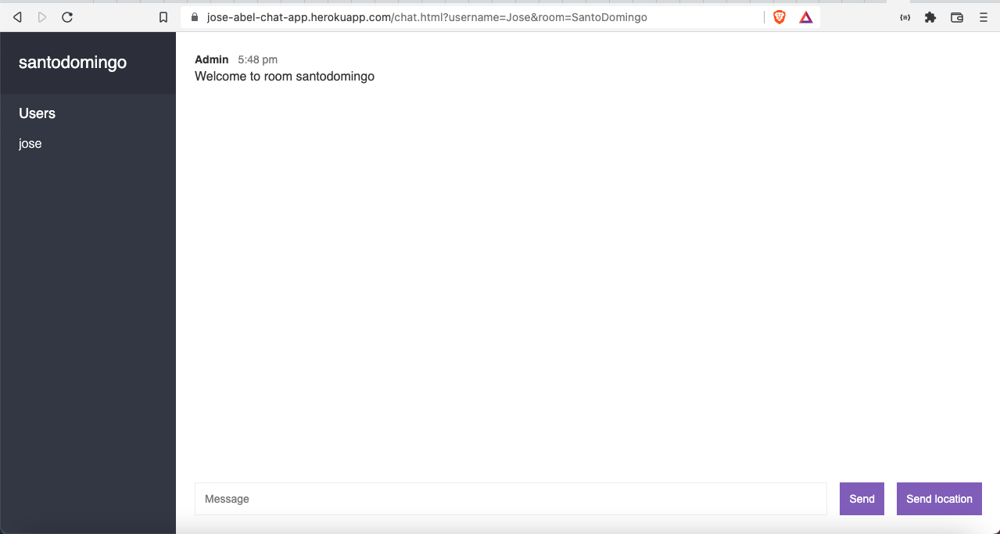

# Chat App

A Chat App build in NodeJS practicing emitting and listening for events with Websockets and socket.io.

## Built With
- HTML
- CSS
- Javascript
- NodeJS

## The following npm packages:
- express
- socket.io
- bad-words
- mustache
- moment
- qs

## Authors
### Author1
- 👤GitHub: [Jose Abel Ramirez Frontany](https://github.com/jose-Abel)
- 👤LinkedIn: [Jose Abel Ramirez Frontany](https://www.linkedin.com/in/joseabelramirezfrontany/)

## Getting Started
You can clone this code anytime and so far you can load the Chat App on your browser through the local port 3000. Since it was build with NodeJS it's require the installation of the npm modules listed in the package.json in the dependencies section.

## Live version
- [live version](https://jose-abel-chat-app.herokuapp.com)

### Setup
You can either copy the code with git clone or just do a git pull on your local environment. In order to run this web app locally you have to do "npm install" so npm can install all libraries included in the package.json file and then run "npm run dev".

## 📝 License
This project is MIT licensed.

## Show your support
Give a ⭐️ if you like this project!